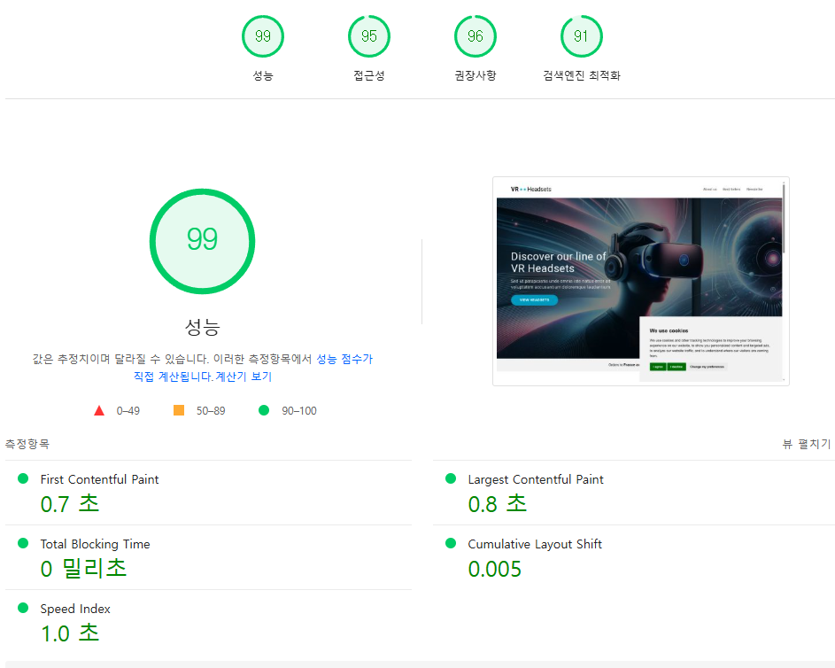

# 바닐라 JS 프로젝트 성능 개선
- url: https://front-5th-chapter4-2-basic-pi.vercel.app/

## 성능 개선 보고서

PageSpeed Insights 링크
- 모바일: https://pagespeed.web.dev/analysis/https-front-5th-chapter4-2-basic-pi-vercel-app/o9ilsln1s8?form_factor=mobile
- 데스크톱: https://pagespeed.web.dev/analysis/https-front-5th-chapter4-2-basic-pi-vercel-app/o9ilsln1s8?form_factor=desktop

### 개선 후 향상된 지표
|개선 전|개선 후|
|---|---|
|||

### LightHouse 점수 비교 
|개선 전|개선 후|
|---|---|
|||

### Core Web Vitals 점수 비교 
|개선 전|개선 후|
|---|---|
|||


## 세부 개선 내용 

### 이미지 최적화
이미지 jpg/png → webp 로 변경
- cwebp 사용(git bash 기준)
    - brew install webp
    - for f in *.jpg; do ./cwebp.exe "$f" -q 75 -o "${f%}.webp"; done

| 파일명           | 최적화 전(JPG) | 최적화 후(WebP) | 절감 용량 | 절감률   |
|------------------|----------------|------------------|-----------|----------|
| Hero_Desktop     | 1,055KB        | 150KB            | 905KB     | 85.8%    |
| Hero_Mobile      | 405KB          | 51KB             | 354KB     | 87.4%    |
| Hero_Tablet      | 770KB          | 99KB             | 671KB     | 87.1%    |
| menu_icon        | 1KB            | 1KB              | 0KB       | 0.0%     |
| vr1              | 53KB           | 7KB              | 46KB      | 86.8%    |
| vr2              | 89KB           | 12KB             | 77KB      | 86.5%    |
| vr3              | 75KB           | 8KB              | 67KB      | 89.3%    |

| 🔻 총 용량 절감  | **2,448KB → 328KB** | 총 절감: **2,120KB (약 86.6%)** |

Lazy Loading 처리 
  ```<picture>
        <source srcset="images/menu_icon.webp" type="image/webp">
        
     </picture>```
사용자가 해당 영역까지 스크롤 할 때 로드되도록 해 초기 페이지 로딩 속도 향상

### 스크립트 최적화
- 스크립트 동기 로드 → script defer 적용
```<!-- Before: 동기 로드 -->
<script src="/js/main.js"></script>
<script src="/js/products.js"></script>

<!-- After: defer 속성 적용 -->
<script src="/js/main.js" defer></script>
<script src="/js/products.js" defer></script>```

해당 스크립트를 읽는 동안 렌더링 차단이 발생해 <script defer> 처리

- Cookie Consent 위치 변경
```<script type="text/javascript" src="//www.freeprivacypolicy.com/public/cookie-consent/4.1.0/cookie-consent.js" charset="UTF-8" async defer></script>
        <script type="text/javascript" charset="UTF-8">
            window.addEventListener('load', function() {
                if (typeof cookieconsent !== 'undefined') {
                    cookieconsent.run({
                        "notice_banner_type": "simple",
                        "consent_type": "express",
                        "palette": "light",
                        "language": "en",
                        "page_load_consent_levels": ["strictly-necessary"],
                        "notice_banner_reject_button_hide": false,
                        "preferences_center_close_button_hide": false,
                        "page_refresh_confirmation_buttons": false,
                        "website_name": "Performance Course"
                    });
                }
            });
        </script>```

- 쿠키 동의 스크립트를 head 태그 내에서 실행 시 TBT가 발생해 성능 저하를 일으킴
- 스크립트를 DOMContentLoaded 이벤트 이후에 실행되도록 수정
